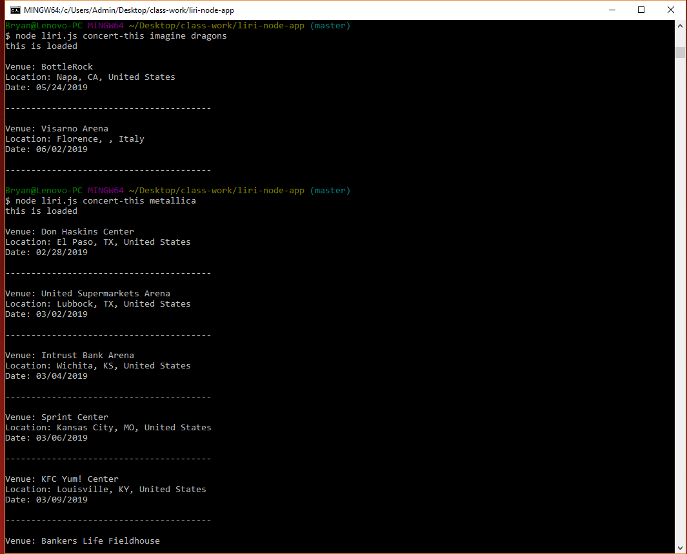
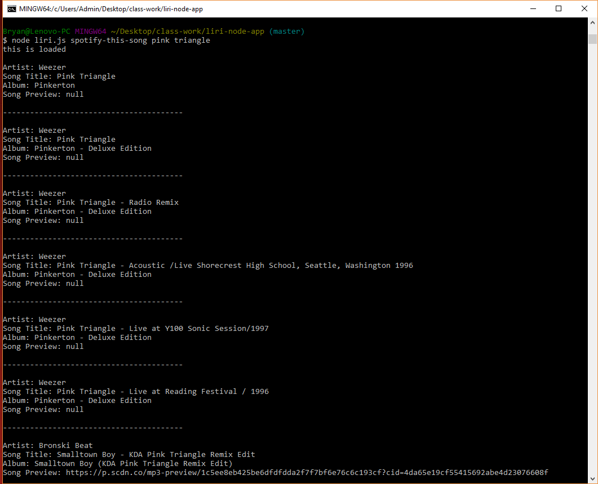
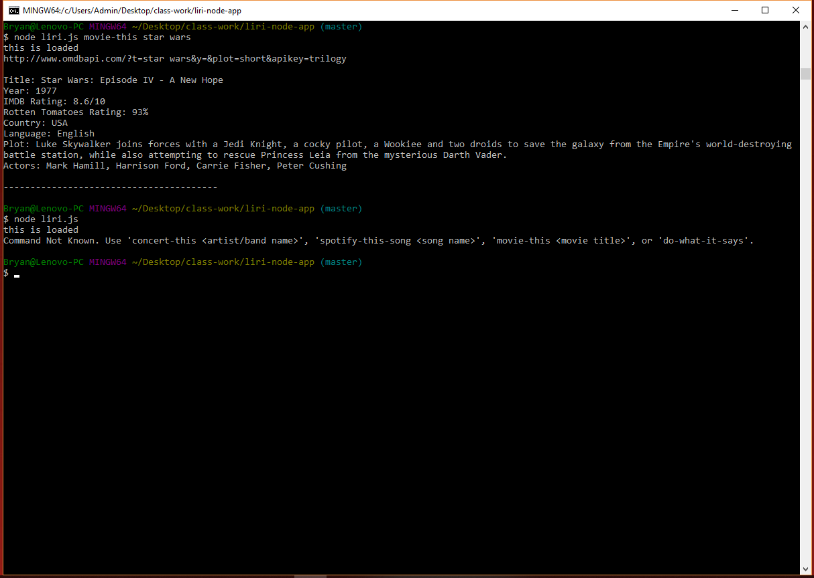
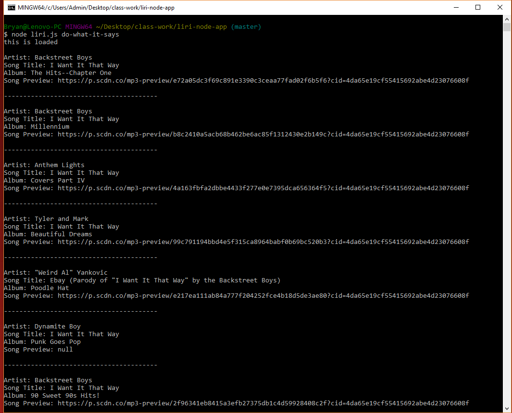

### Overview

In this assignment, you will make LIRI. LIRI is like iPhone's SIRI. However, while SIRI is a Speech Interpretation and Recognition Interface, LIRI is a _Language_ Interpretation and Recognition Interface. LIRI will be a command line node app that takes in parameters and gives you back data.

LIRI will search Spotify for songs, Bands in Town for concerts, and OMDB for movies.

## Submission Guide

Create and use a standard GitHub repository. As this is a CLI App, it cannot be deployed to GitHub pages or Heroku. This time you'll need to include screenshots, a GIF, and/or a video showing us that you have the app working with no bugs. You can include these screenshots/GIFs or a link to a video in a `README.md` file.

* Include screenshots (or a GIF/Video) of the typical user flow of your application. Make sure to include the use of Spotify, Bands in Town, and OMDB.

* Include any other screenshots you deem necessary to help someone who has never been introduced to your application understand the purpose and function of it. This is how you will communicate to potential employers/other developers in the future what you built and why, and to show how it works.

* Because screenshots (and well-written READMEs) are extremely important in the context of GitHub, this will be part of the grading.

If you haven't written a markdown file yet, [click here for a rundown](https://guides.github.com/features/mastering-markdown/), or just take a look at the raw file of these instructions.

### Submission on BCS

* Please submit the link to the Github Repository!

### What Each Command Should Do

1. `node liri.js concert-this <artist/band name here>`

   * This will search the Bands in Town Artist Events API (`"https://rest.bandsintown.com/artists/" + artist + "/events?app_id=codingbootcamp"`) for an artist and render the following information about each event to the terminal:

     * Name of the venue

     * Venue location

     * Date of the Event (use moment to format this as "MM/DD/YYYY")

    

2. `node liri.js spotify-this-song '<song name here>'`

   * This will show the following information about the song in your terminal/bash window

     * Artist(s)

     * The song's name

     * A preview link of the song from Spotify

     * The album that the song is from

   * If no song is provided then your program will default to "The Sign" by Ace of Base.

    

3. `node liri.js movie-this '<movie name here>'`

   * This will output the following information to your terminal/bash window:

    ```
       * Title of the movie.
       * Year the movie came out.
       * IMDB Rating of the movie.
       * Rotten Tomatoes Rating of the movie.
       * Country where the movie was produced.
       * Language of the movie.
       * Plot of the movie.
       * Actors in the movie.
    ```
   * If the user doesn't type a movie in, the program will output data for the movie 'Mr. Nobody.'

    

4. `node liri.js do-what-it-says`

   * Using the `fs` Node package, LIRI will take the text inside of random.txt and then use it to call one of LIRI's commands.

     * It should run `spotify-this-song` for "I Want it That Way," as follows the text in `random.txt`.

    

### BONUS

* In addition to logging the data to your terminal/bash window, output the data to a .txt file called `log.txt`.

* Make sure you append each command you run to the `log.txt` file. 

* Do not overwrite your file each time you run a command.